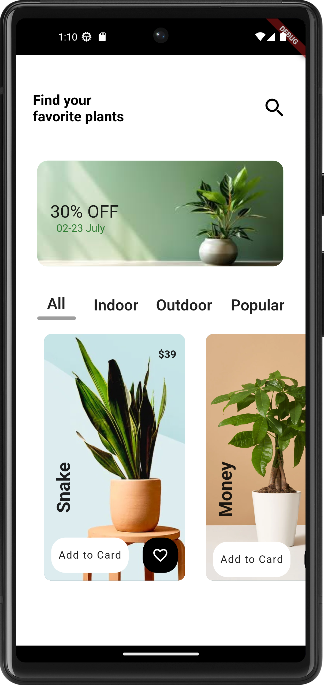
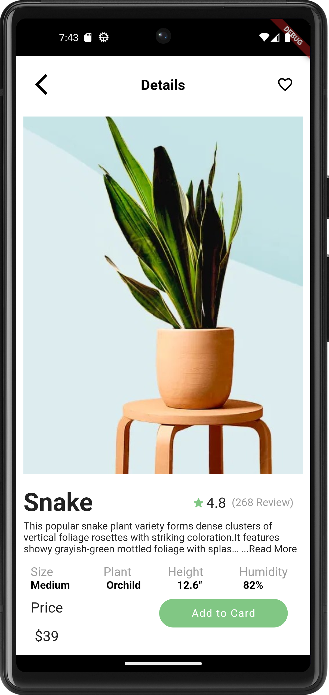

# LeafyLane

**LeafyLane** is a mobile application built with Flutter and Dart, designed to provide a seamless and enjoyable plant shopping experience. With a clean and intuitive interface, users can browse, search, and purchase a variety of plants directly from their mobile devices.

## Table of Contents

- [Features](#features)
- [Screenshots](#screenshots)
- [Installation](#installation)
- [Usage](#usage)
- [License](#license)

## Features

- **Browse Plants:** Explore a wide range of plants with detailed descriptions and images.
- **Search Functionality:** Quickly find specific plants using the search feature.
- **User Authentication:** Secure login and registration for users(still under-development).
- **Shopping Cart:** Add plants to your cart and proceed to checkout(still under-development).
- **Wishlist:** Save your favorite plants to a wishlist for future purchases((still under-development)).

## Screenshots




## Usage

- **Browse the list of available plants.**
- **Search for specific plants using the search bar.**
- **View detailed information about each plant.**
- **Add plants to your shopping cart.**
- **Save plants to your wishlist for future reference.**


## Installation

To get a local copy up and running follow these simple steps:

### Prerequisites

- [Flutter](https://flutter.dev/docs/get-started/install) - Make sure Flutter is installed on your machine.
- Dart - Dart is included with Flutter.

### Clone the repository

```bash
git clone https://github.com/Nirali2611/LeafyLane.git
cd LeafyLane
flutter pub get
flutter run
```

## License

- **Distributed under the MIT License. See LICENSE for more information.**